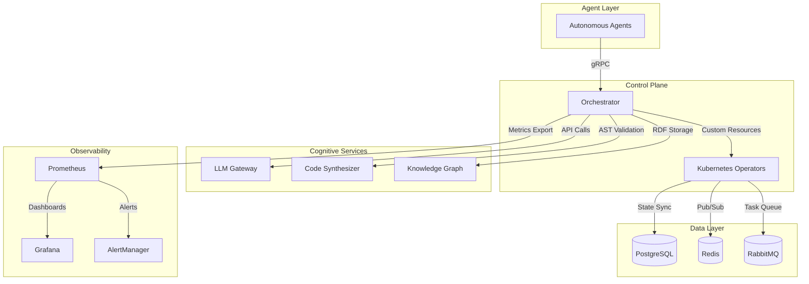

# Phasma AI 

[](https://github.com/your-org/phasma-ai/actions)
[](https://github.com/your-org/phasma-ai/releases)
[](https://opensource.org/licenses/Apache-2.0)
[](https://docs.phasma.ai)

**Autonomous agents with dynamic orchestration enabling real-time R&D, coding & API automation via decentralized collaboration.**

[Phasma AI Website](https://phasmaai.com/)

📢 [Twitter](https://twitter.com/PhasmaAILAB)  

##  Core Capabilities

### Multi-Agent Collaboration
- **Dynamic DAG Workflows**  
  Real-time workflow compilation with self-optimizing task graphs
- **Agent Negotiation Protocol**  
  Byzantine fault-tolerant consensus for distributed decisions
- **Resource-Aware Scheduling**  
  Predictive allocation using LSTM-based workload forecasting

### Cognitive Automation
- **LLM Gateway Service**  
  Unified API for 20+ AI models (GPT-4, Claude 3, Gemini Pro)
- **Code Synthesis Engine**  
  AST-validated code generation with vulnerability scanning
- **Self-Healing Runtime**  
  Auto-remediation of failed tasks through RL-powered strategies

### Enterprise Readiness
- **Zero-Trust Architecture**  
  FIPS 140-3 compliant crypto modules with hardware root-of-trust
- **Compliance Guardrails**  
  Built-in GDPR/HIPAA/SOC2 policy enforcement engine
- **Observability Stack**  
  Unified metrics (Prometheus), logs (Loki), traces (Tempo)

##  Architecture Overview



## Quick Start
### Prerequisites
- Kubernetes 1.25+
- Helm 3.12+
- PostgreSQL 15+
- NVIDIA GPU Operator (Optional)

### Installation
```
# Add Helm repo
helm repo add phasma https://charts.phasma.ai

# Install core components
helm install phasma-core phasma/phasma \
  --namespace phasma-system \
  --create-namespace \
  --set global.enableGPU=true \
  --set compliance.gdpr.enabled=true
```

### Configuration
```
# values-prod.yaml
compliance:
  framework: "gdpr+hipaa"
  auditMode: "continuous"

llm:
  endpoints:
    - provider: "openai"
      model: "gpt-4-turbo"
      apiKeySecret: "openai-key"
  
autoscaling:
  minReplicas: 5
  maxReplicas: 100
  metrics:
    - type: "llm_inference_latency"
      target: "500ms"
```

##  Usage Examples
### Start Research Agent
```
from phasma.sdk import AgentSession

async with AgentSession(policy="research") as session:
    report = await session.execute(
        task="analyze_arxiv_papers",
        params={
            "query": "multi-agent reinforcement learning",
            "timeframe": "2024-01/2024-05"
        }
    )
    print(report.summary)
```

### Deploy Workflow
```
kubectl apply -f - <<EOF
apiVersion: orchestration.phasma.ai/v1
kind: CognitiveWorkflow
metadata:
  name: market-analysis
spec:
  tasks:
    - agent: research
      input: "Q2 2024 AI chip market trends"
    - agent: coding
      dependsOn: [research]
      input: "Generate comparative analysis dashboard"
EOF
```

## Contributing
### Development Setup
```
git clone https://github.com/your-org/phasma-ai.git
make init-dev # Installs pre-commit, dependency checkers
make proto-gen # Generates gRPC/protobuf stubs
```

### Contribution Workflow

### 1. Fork repository
### 2. Create feature branch (feat/..., fix/...)
### 3. Submit PR with:
- Signed-off commits
- Threat model analysis for security features
- Performance benchmarks for core changes
